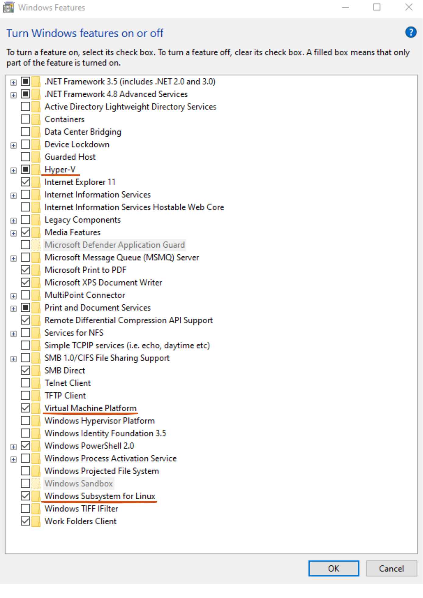
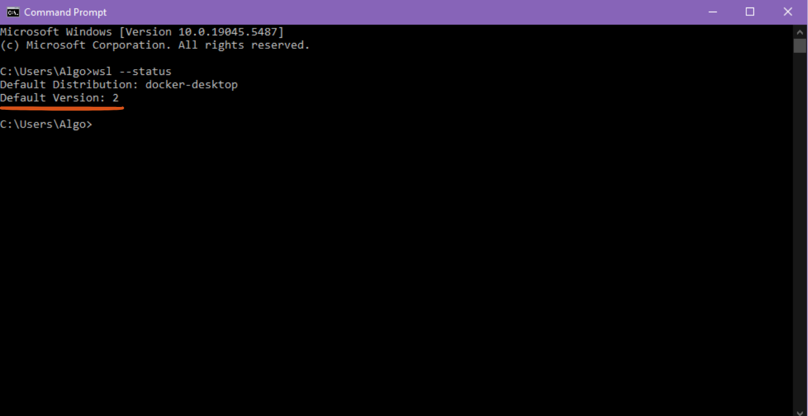
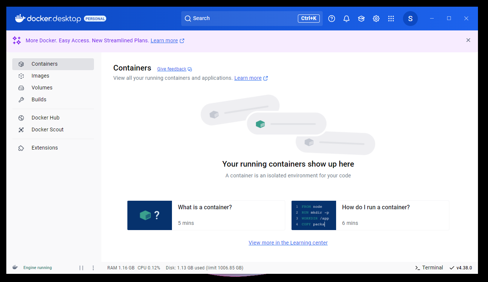

# How to Install Docker in Windows

## Table of Contents

1. [Requirements](#requirements)
2. [Installation Steps](#installation)
3. [Troubleshooting](#troubleshooting)
4. [Uninstallation](#uninstallation)
5. [Additional Resources](#add_resources)
6. [License](#license)

## Requirements

- **Operating System:**

  - Windows 10 (64-bit) Pro, Enterprise, or Education (Build 1909 or later)
  - Windows 11 (64-bit) Pro, Enterprise, or Education
  - Windows 10/11 Home with WSL 2 enabled

- **Processor:** 64-bit processor with Second Level Address Translation (SLAT)

- **RAM:** Minimum 4 GB (8 GB recommended)

- **Virtualization:**

  - Hyper-V and Containers features enabled
  - Virutal Machine Platform enabled
  - Virtualization Technology (VT-x) enabled in BIOS/UEFI

- **Windows Subsystem for Linux (WSL 2)** (recommended) / **Microsoft Hyper-V**

## Installation Steps

### 1\. Enable Virtualization in BIOS/UEFI

- Open **PowerShell** as Administrator and run:

  ```powershell
  dism.exe /online /enable-feature /featurename:Microsoft-Hyper-V-All /all /norestart
  dism.exe /online /enable-feature /featurename:Containers /all /norestart
  ```

  or just go to bios and turn on virtualization manually.

<p float="left">
  

### 2\. Enable required Services

Search **Turn Windows Features**. Turn on Hyper-V, Virtual Machine Platform, Windows Subsystems for Linux.

<p float="left">
  

### 3\. Enable WSL 2

- Open **PowerShell** as Administrator and run:

```powershell
  wsl --status
```

to check wsl installed or not. If not run

```powershell
  wsl --install
  wsl --update
```

Also check if wsl version 2 is selected or not. If not select it by running

```powershell
  wsl --set-default-version 2
```
<p float="left">
  

### 4. Download and Install Docker Desktop

- Download Docker Desktop from the official site: [Docker Desktop](https://www.docker.com/products/docker-desktop)
- Run the installer and follow the on-screen instructions.
- Select **WSL 2** as the backend if prompted.
- Restart your computer if necessary.

### 5. Verify Installation

- Open **PowerShell** or **Command Prompt** and run:
  ```powershell
  docker --version
  ```
  This should return the installed Docker version. Docker Desktop can be checked for verificaiton.
<p float="left">
  

### 6. Test Docker

- Run a test container to confirm Docker is working:
  ```powershell
  docker run hello-world
  ```
  If successful, Docker will print a welcome message.


## Troubleshooting

### Virtualization Issues

- Ensure **VT-x** or **AMD-V** is enabled in BIOS.
- Check if Hyper-V is enabled by running:
  ```powershell
  systeminfo | find "Hyper-V Requirements"
  ```
### WSL 2 Issues

- If WSL 2 is not installed, install the kernel update from Microsoft: [WSL 2 Update](https://aka.ms/wsl2kernel)

## Uninstallation

If you are using Docker Desktop, right-click the Docker icon in the system tray and select Quit Docker.

To uninstall Docker:

- Open **Settings > Apps** and uninstall **Docker Desktop**.
- Remove **Docker-related directories**:
  ```powershell
  Remove-Item -Recurse -Force "C:\Program Files\Docker"
  Remove-Item -Recurse -Force "C:\Program Files (x86)\Docker"
  ```

## Additional Resources

- [Docker Documentation](https://docs.docker.com/)
- [Windows Subsystem for Linux](https://docs.microsoft.com/en-us/windows/wsl/)

## Licences

This repository is licensed under the MIT License - see the LICENSE file for details.